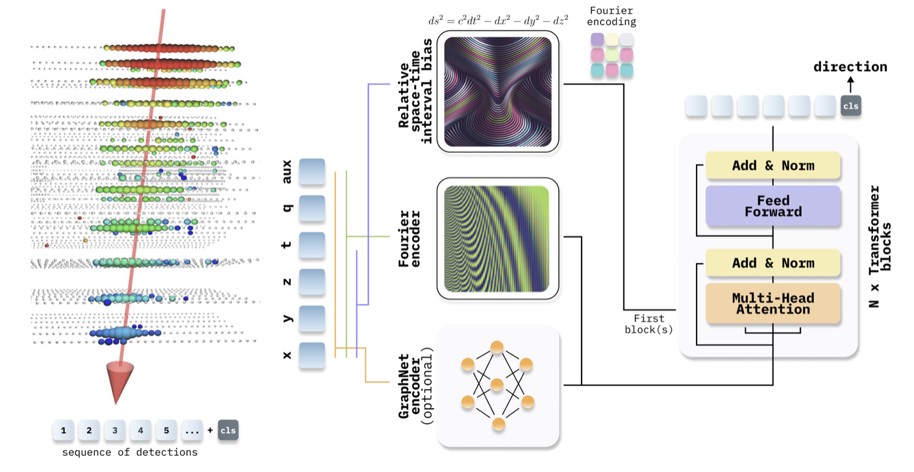

<div align="center">

# IceCube Neutrino Direction Reconstruction

### 2nd Place Solution | Kaggle Competition | Peer-Reviewed Publication

[](https://www.kaggle.com/competitions/icecube-neutrinos-in-deep-ice)
[](https://link.springer.com/article/10.1140/epjc/s10052-024-12977-2)
[](https://arxiv.org/abs/2310.15674)

**Transformer + GNN architecture achieving less than 5 deg angular resolution on cascade events**

*[Habib Bukhari](https://www.kaggle.com/drhabib) & [Iafoss](https://www.kaggle.com/iafoss)*

</div>

---

## Key Achievements

| Metric | Result |
|--------|--------|
| **Competition Rank** | 2nd out of 901 teams |
| **Cascade Events (>10 TeV)** | <5 deg angular resolution |
| **Track Events** | <0.5 deg angular resolution |
| **Publication** | European Physical Journal C (2024) |

## Technical Highlights

- **Novel Architecture**: Transformer encoder with Graph Neural Network (GNN) combining local and global attention
- **Von Mises-Fisher Loss**: Probabilistic loss function for 3D directional regression on the sphere
- **Ensemble Strategy**: Weighted combination of 5 model variants for robust predictions
- **Efficient Processing**: Handles variable-length pulse sequences up to 768 pulses

## Model Architecture

<p align="center">
  
</p>

The architecture processes IceCube detector pulses through:
1. **Feature Embedding**: DOM positions, pulse times, charges, and ice properties
2. **Transformer Blocks**: BEiTv2-style attention with relative position encoding
3. **GNN Layers**: Graph attention for spatial relationships between sensors
4. **Direction Head**: Von Mises-Fisher distribution parameters for 3D direction

---

## Overview

This repository contains the source code for the 2nd place solution in the [Kaggle IceCube Neutrino Detection Competition](https://www.kaggle.com/competitions/icecube-neutrinos-in-deep-ice). For more technical write up read [here](https://www.kaggle.com/competitions/icecube-neutrinos-in-deep-ice/discussion/402882). To reproduce our results, please follow the instructions provided below.

## Installation

We recommend using the official `nvidia` or `kaggle` Docker images with the appropriate CUDA version for the best compatibility

1. Clone the repository

```bash
git clone https://github.com/DrHB/icecube-2nd-place.git
```

2. Navigate to the repository folder:

```bash
cd icecube-2nd-place
```

3. Install the required packages:

```bash
pip install -r requirements.txt
```

## Data Download and Preparation

### Downloading the Competition Data

The official competition data can be obtained from the [Kaggle website](https://www.kaggle.com/c/icecube-neutrinos-in-deep-ice/data). Please download the data and place it in the data folder within the repository.

### Additional Datasets

1. Split `train_meta` `parquet` files for each batch, available for download [here](https://www.kaggle.com/datasets/solverworld/train-meta-parquet).

2. The [`ice_transparency.txt`](https://www.kaggle.com/datasets/anjum48/icecubetransparency) file, which contains information regarding the ice transparency of the IceCube detector.

### Preparing the Data

Create the `Nevents.pickle` file by executing the following command:

```bash
python prepare_data.py config.json PATH data
```

After completing the data preparation process, your `data` folder should have the following structure:

```bash
data/
├── Nevents.pickle
├── ice_transparency.txt
├── sample_submission.parquet
├── sensor_geometry.csv
├── test
│   └── batch_661.parquet
├── test_meta.parquet
├── train
│   ├── batch_1.parquet
│   └── batch_2.parquet
└── train_meta
    ├── train_meta_1.parquet
    └── train_meta_2.parquet
```

## Configuration Documentation

The `config.json` file contains various settings and parameters for the training process. Below is a brief explanation of each parameter:

| Parameter      | Value                   | Description                                |
| -------------- | ----------------------- | ------------------------------------------ |
| `SELECTION`    | `total`                 | Selection criterion for the data           |
| `OUT`          | `BASELINE`              | Output folder name                         |
| `PATH`         | `data/`                 | Path to the data folder                    |
| `NUM_WORKERS`  | `4`                     | Number of worker threads for data loading  |
| `SEED`         | `2023`                  | Random seed value for reproducibility      |
| `BS`           | `32`                    | Batch size for training                    |
| `BS_VALID`     | `32`                    | Batch size for validation                  |
| `L`            | `192`                   | Length of input sequence for training      |
| `L_VALID`      | `192`                   | Length of input sequence for validation    |
| `EPOCHS`       | `8`                     | Number of training epochs                  |
| `MODEL`        | `DeepIceModel`          | Model architecture, choise                 |
| `MOMS`         | `false`                 | Momentum scheduling in the optimizer       |
| `DIV`          | `25`                    | Initial learning rate divisor              |
| `LR_MAX`       | `5e-4`                  | Max learning rate                          |
| `DIV_FINAL`    | `25`                    | Final learning rate divisor                |
| `EMA`          | `false`                 | Exponential Moving Average during training |
| `MODEL_KWARGS` | `(see below)`           | Model-specific parameters                  |
| `WEIGHTS`      | `false`                 | Class weights in the loss function         |
| `LOSS_FUNC`    | `{loss_vms, loss_comb}` | Loss function                              |
| `METRIC`       | `loss`                  | Evaluation metric for model selection      |

For `MODEL_KWARGS`, we have the following parameters:
|Parameter|Value|Description |
|---------|-----|-----------------------------------------|
|`dim` |`384` |Input dimension of the model |
|`dim_base` |`128` |Base dimension for the model layers |
|`depth` |`8` |Number of layers in the model |
|`head_size`|`32` |Head size for multi-head attention layers|

## Training

### `B MODEL 32`

The training process is performed in an `epoch`-based manner. Each `epoch` is divided into `8` `sub-epochs`, essentially dividing the full training data into `8` subsections. The model is trained for a total of `4` `epochs`, using a `one_cycle` learning schedule. After each `epoch`, the best `checkpoint` is loaded, and the training continues with a decreased `learning rate`. The Exponential Moving Average (`EMA`) and the `loss_comb` function are added closer to the last `epoch`. The example below demonstrates training the `B` model for `4` `epochs`. The `OUT` parameter defines a folder where the model `weights` will be stored. For the next `epoch`, the folder is used to load checkpoints and continue training.

```python
# B model 32
python train.py config.json \
       MODEL DeepIceModel \
       MODEL_KWARGS.dim 384 \
       MODEL_KWARGS.dim_base 128 \
       MODEL_KWARGS.depth 12 \
       MODEL_KWARGS.head_size 32 \
       OUT B_MODEL_32 \
       LR_MAX 5e-4 \
       MOMS false

# The results will be stored in the folder B_MODEL_32
# For the 2nd epoch, we will resume training from the checkpoint
python train.py config.json \
       MODEL DeepIceModel \
       MODEL_KWARGS.dim 384 \
       MODEL_KWARGS.dim_base 128 \
       MODEL_KWARGS.depth 12 \
       MODEL_KWARGS.head_size 32 \
       OUT B_MODEL_32FT \
       WEIGHTS B_MODEL_32/models/model_7.pth \
       LR_MAX 2e-5 \
       DIV 25 \
       DIV_FINAL 25 \

# The results will be stored in the folder B_MODEL_32FT
# For the 3rd epoch, we will resume training from the checkpoint
python train.py config.json \
       MODEL DeepIceModel \
       MODEL_KWARGS.dim 384 \
       MODEL_KWARGS.dim_base 128 \
       MODEL_KWARGS.depth 12 \
       MODEL_KWARGS.head_size 32 \
       OUT B_MODEL_32FT2 \
       WEIGHTS B_MODEL_32FT/models/model_7.pth \
       LR_MAX 1e-5 \
       DIV 25 \
       DIV_FINAL 25 \
       EMA true \

# The results will be stored in the folder B_MODEL_32FT2
# For the 4th epoch, we will resume training from the checkpoint
python train.py config.json \
       MODEL DeepIceModel \
       MODEL_KWARGS.dim 384 \
       MODEL_KWARGS.dim_base 128 \
       MODEL_KWARGS.depth 12 \
       MODEL_KWARGS.head_size 32 \
       OUT B_MODEL_32FT3 \
       WEIGHTS B_MODEL_32FT2/models/model_7.pth \
       LR_MAX 0.5e-5 \
       DIV 25 \
       DIV_FINAL 25 \
       EMA true \
       LOSS_FUNC loss_comb \

```

### `B MODEL 64`

```python
# B model 64
python train.py config.json \
       MODEL DeepIceModel \
       MODEL_KWARGS.dim 768 \
       MODEL_KWARGS.dim_base 192 \
       MODEL_KWARGS.depth 12 \
       MODEL_KWARGS.head_size 64\
       OUT B_MODEL_B_64 \
       LR_MAX 1e-4 \
       MOMS false

# The results will be stored in the folder B_MODEL_B_64
# For the 2nd epoch, we will resume training from the checkpoint
python train.py config.json \
       MODEL DeepIceModel \
       MODEL_KWARGS.dim 768 \
       MODEL_KWARGS.dim_base 192 \
       MODEL_KWARGS.depth 12 \
       MODEL_KWARGS.head_size 64\
       OUT B_MODEL_64FT \
       WEIGHTS B_MODEL_64/models/model_7.pth \
       LR_MAX 1e-5 \
       DIV 25 \
       DIV_FINAL 25 \

# The results will be stored in the folder B_MODEL_B_64FT
# For the 3nd epoch, we will resume training from the checkpoint
python train.py config.json \
       MODEL DeepIceModel \
       MODEL_KWARGS.dim 768 \
       MODEL_KWARGS.dim_base 192 \
       MODEL_KWARGS.depth 12 \
       MODEL_KWARGS.head_size 64\
       OUT B_MODEL_64FT2 \
       WEIGHTS B_MODEL_64FT/models/model_7.pth \
       LR_MAX 0.5e-5 \
       DIV 15 \
       DIV_FINAL 15 \
       EMA true \
       LOSS_FUNC loss_comb \

# The results will be stored in the folder B_MODEL_B_64FT3
# For the 4th epoch, we will resume training from the checkpoint
python train.py config.json \
       MODEL DeepIceModel \
       MODEL_KWARGS.dim 768 \
       MODEL_KWARGS.dim_base 192 \
       MODEL_KWARGS.depth 12 \
       MODEL_KWARGS.head_size 64\
       OUT B_MODEL_64FT3 \
       WEIGHTS B_MODEL_64FT2/models/model_7.pth \
       LR_MAX 0.35e-5 \
       DIV 10 \
       DIV_FINAL 10 \
       EMA true \
       LOSS_FUNC loss_comb \


# The results will be stored in the folder B_MODEL_B_64FT4
# For the 4th epoch, we will resume training from the checkpoint
python train.py config.json \
       MODEL DeepIceModel \
       MODEL_KWARGS.dim 768 \
       MODEL_KWARGS.dim_base 192 \
       MODEL_KWARGS.depth 12 \
       MODEL_KWARGS.head_size 64\
       OUT B_MODEL_64FT4 \
       WEIGHTS B_MODEL_64FT3/models/model_7.pth \
       LR_MAX 1.0e-6 \
       DIV 10 \
       DIV_FINAL 10 \
       EMA true \
       LOSS_FUNC loss_comb \


```

### `B MODEL 64`

model definiation can be found below, for training use the same paramaters as for training `B MODEL 64`

```python
# B model 4 REL
python train.py config.json \
       MODEL DeepIceModel \
       MODEL_KWARGS.dim 768 \
       MODEL_KWARGS.dim_base 192 \
       MODEL_KWARGS.depth 12 \
       MODEL_KWARGS.head_size 32 \
       MODEL_KWARGS.n_rel 4
       ....


```

### `S_MODEL_GNN`

model definiation can be found below, for training use the same paramaters as for training `B MODEL 64`

```python
# S + GNN
python train.py config.json \
       MODEL EncoderWithDirectionReconstructionV22 \
       MODEL_KWARGS.dim 384 \
       MODEL_KWARGS.dim_base 128 \
       MODEL_KWARGS.depth 8 \
       MODEL_KWARGS.head_size 32
       ....

```

### `B_MODEL_GNN`

model definiation can be found below, for training use the same paramaters as for training `B MODEL 64`

```python
# B + GNN
python train.py config.json \
       MODEL EncoderWithDirectionReconstructionV23 \
       MODEL_KWARGS.dim 768 \
       MODEL_KWARGS.dim_base 128 \
       MODEL_KWARGS.depth 12 \
       MODEL_KWARGS.head_size 64
       ....

```

## Infrence

Our inference scripts, models, and kernels are publicly available and can be found [here](https://www.kaggle.com/code/iafoss/icecube-inference-combine-weight?scriptVersionId=126305244) and [here](https://www.kaggle.com/code/iafoss/icecube-inference-combine-weight?scriptVersionId=126419156). To perform inference using our best models, download the model weights from this [link](https://www.kaggle.com/datasets/drhabib/ice-cube-final-models/settings) and place them in the `ice-cube-final-models` folder. Then, execute the following Python script:

```bash
python predict.py config.json L 512 BS 32
```

This script can be adapted to run inference for any model that was trained locally. By executing the script with the appropriate configurations, you can perform inference using the selected models and generate predictions based on the trained weights.
